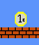
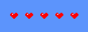

# Mario PRO2 2026 — Martin Molina

>[!IMPORTANT]
>
>Sin Acabar!

---

## Info

Juego estilo Mario de la asignatura de PRO2 de la FIB 2026 


---

## To Do:

- Pulir Cosas

## Controles del juego

| Acción    | Tecla |
|----------|------|
| Saltar   | `SPACE` |
| Izquierda| `A` |
| Derecha  | `D` |
| Pausar   | `P` |
| Reiniciar   | `R` |
| Suicidarse   | `K` |
| Curarse   | `H` |
| Restar Vida   | `-` |
| Monedas   | `M` |
| Quitar Moneda   | `N` |

---

## Objetos del juego

- **Monedas** → Euros, se pueden recoger y tienen su animacion

---

- **Fantasmas** → Son enemigos, si te chocas con ellos, te restan una vida

---

- **Nube** → Una nube, simplemente

---

- **Contador Vidas** → Contador de Vidas

---

- **Contador Monedas** → Contador de Monedas

---

## Comandos de terminal

```bash
make        # Compila el juego
make clean  # Borra archivos compilados
make tgz    # Comprime el proyecto
make push   # Sube cambios a GitHub
make save   # Gurda todo lo hecho en GitHub
make pull   # Actualiza el repositorio
